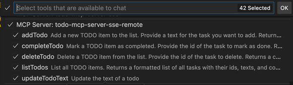
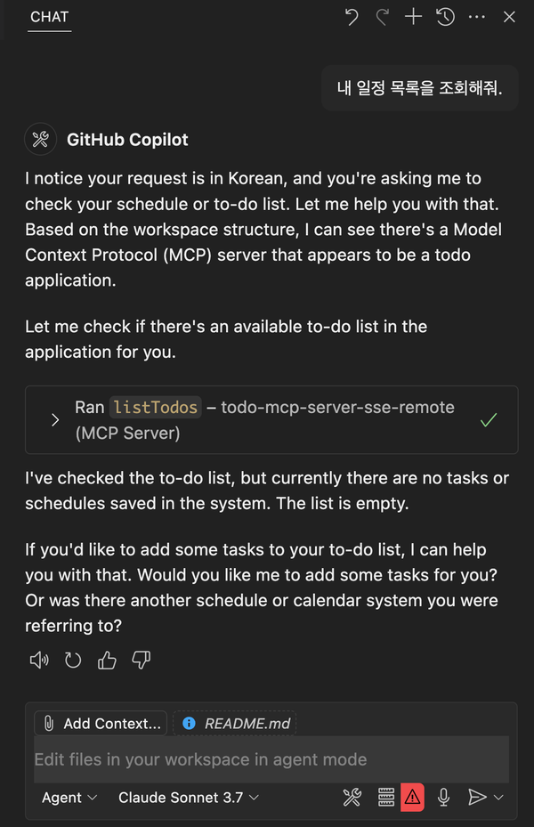
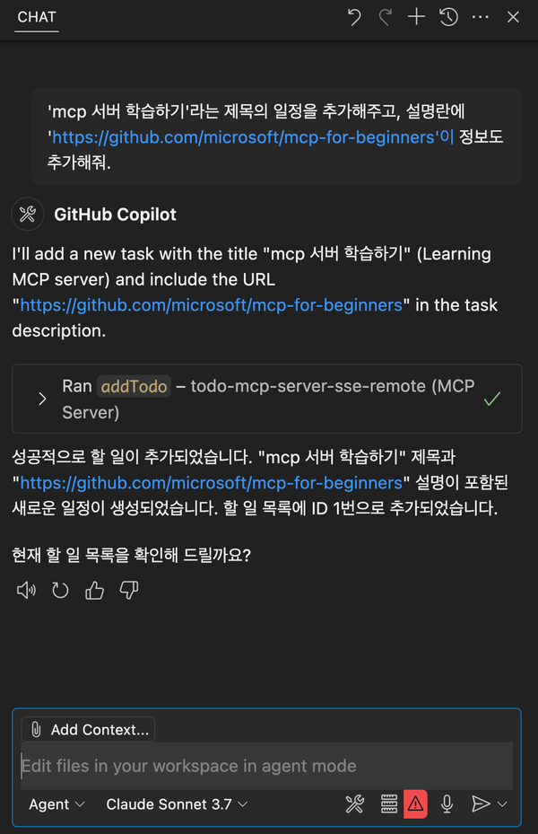
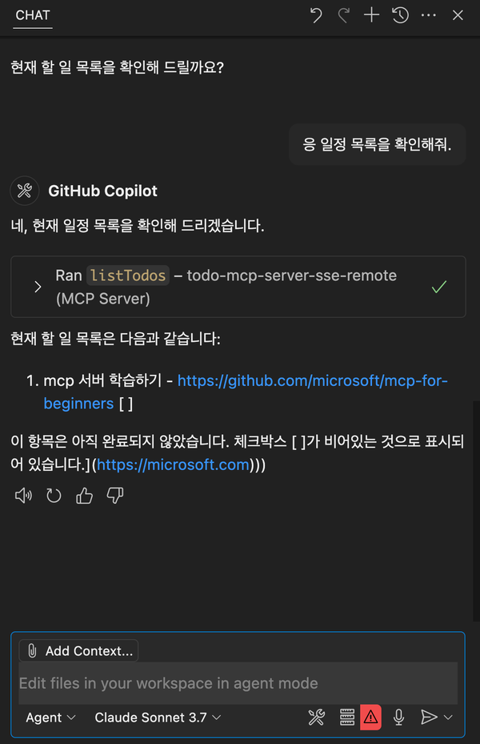
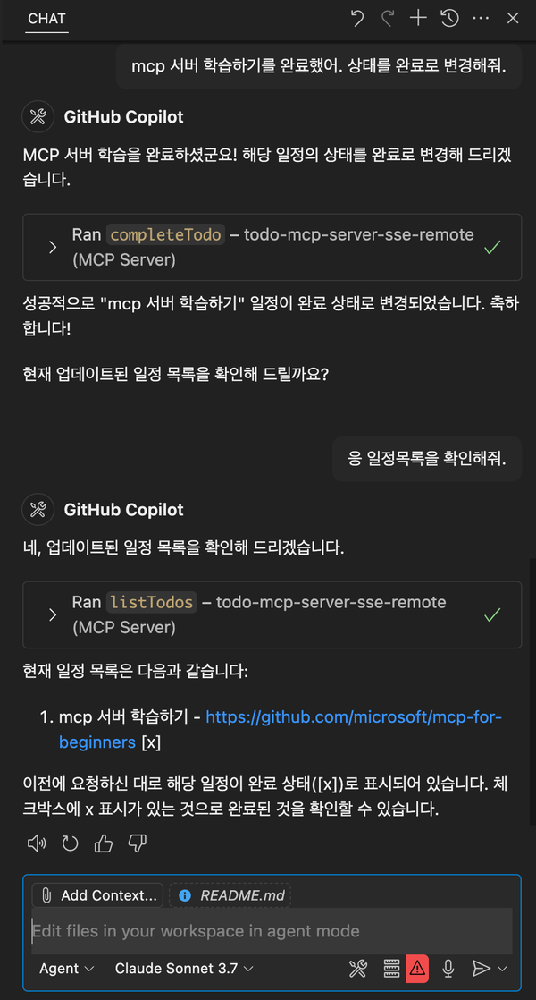

<!--
---
name: Remote MCP with Azure Container Apps (Node.js/TypeScript/JavaScript)
description: Run a remote node.js MCP server on Azure Container Apps.  
languages:
- typescript
- javascript
- nodejs
- bicep
- azdeveloper
products:
- azure-container-apps
- azure
page_type: sample
urlFragment: mcp-container-ts
---
-->
# Azure Container Apps, Node.js/TypeScript를 사용한 일정관리 MCP 서버 만들기

이 저장소는 일정관리 Model Context Protocol(MCP) 서버를 구축하기 위한 방법을 설명합니다.
주요 기술스택은 Node.js와 TypeScript이며, 이 저장소를 템플릿으로 활용하면 Node.js/TypeScript 개발자들도 쉽게 MCP 서버를 구축하고, 이해할 수 있게 됩니다.

## 사전 준비

1. [VS Code](https://code.visualstudio.com/) 설치
2. [GitHub Copilot](https://marketplace.visualstudio.com/items?itemName=GitHub.copilot)과 [GitHub Copilot Chat](https://marketplace.visualstudio.com/items?itemName=GitHub.copilot-chat) 익스텐션 설치
3. [Azure Developer CLI](https://learn.microsoft.com/en-us/azure/developer/azure-developer-cli/install-azd)(azd) 설치

## 인프라 구성

이 프로젝트는 Azure Container Apps를 사용하여 MCP(Model Context Protocol) 서버를 서버리스로 배포하고 있습니다.

프로젝트의 인프라 구성은 다음과 같습니다.

1. Azure Container Apps - [`resources.bicep`](./infra/resources.bicep) 파일에서 정의된 서버리스 컨테이너 환경
2. Azure Container Registry - 컨테이너 이미지 저장을 위한 레지스트리
3. Azure Monitor - 로그 분석 및 애플리케이션 인사이트를 위한 모니터링 도구
4. Managed Identity - 보안 액세스를 위한 관리형 ID

별도의 데이터베이스는 사용하지 않으며, MCP 서버는 인메모리 SQLite 데이터베이스를 사용하여 상태를 관리합니다. 이 데이터베이스는 서버가 재시작되면 초기화됩니다.

```ts
// src/db.ts 참고
const db = new Database(":memory:", {
  verbose: log.info,
});
```

데이터 영속성이 필요한 경우, Azure Cosmos DB나 Azure SQL Database와 같은 외부 데이터베이스를 추가로 설정할 수 있습니다. 이 경우, MCP 서버의 코드에서 데이터베이스 연결을 설정하고, 필요한 CRUD 작업을 구현해야 합니다.

## 개발 환경 설정

VS Code를 열고 터미널에 다음 명령어를 입력하여 개발에 필요한 환경을 구성합니다.

1. 저장소 클론

```cmd
git clone https://github.com/azure-samples/mcp-container-ts.git
```

2. Azure 계정에 로그인

```cmd
azd auth login
```

3. 프로젝트 프로비저닝 및 배포 (명령어는 클론한 리포지토리 안에서 실행)

```cmd
azd up
```

4. 성공적으로 배포가 완료되면, terminal에 출력된 URL을 통해 MCP 서버에 접근할 수 있습니다. URL은 다음과 같은 형식입니다.

```cmd
https://<env-name>.<container-id>.<region>.azurecontainerapps.io
```

5. VS Code의 `mcp.json` 파일을 열고 다음과 같이 MCP 서버의 URL을 추가하면 MCP 서버를 사용할 수 있습니다.

```json
{
  "servers": {
    "todo-mcp-server-sse-remote": {
      "type": "sse",
      "url": "https://<your-app-name>.<region>.azurecontainerapps.io/sse"
    }
  }
}
```

> [!NOTE]
> 이 템플릿을 사용하여 배포한 MCP 서버는 Azure Container Apps에서 실행되기 때문에 MCP 서버의 URL은 배포마다 다를 수 있습니다. 새로운 배포를 하면 `mcp.json` 파일이나 MCP 클라이언트 설정에서 URL을 적절히 업데이트해야 합니다.

6. Azure Container Apps에 배포한 원격 MCP 서버가 제대로 VS Code(MCP Host)에 연동되었다면 Configure Tools 아이콘(연장 아이콘)을 클릭시 다음과 같은 메뉴를 볼 수 있습니다.
  
<!-- Centered image for visual emphasis -->


7. 또한 GitHub Copilot Chat의 Agent 모드에서도 채팅창(MCP Client)에 프롬프트를 입력해 일정관리 작업을 할 수 있게 됩니다.

<!-- Centered image for visual emphasis -->


<!-- Centered image for visual emphasis -->


<!-- Centered image for visual emphasis -->


<!-- Centered image for visual emphasis -->


8. 템플릿이 잘 동작하는지 테스트 용으로 본 MCP를 배포한 경우엔, 다음 명령어를 실행하여 배포된 모든 리소스를 제거하고 정리할 수 있습니다. 추가 과금이 되지 않길 원한다면 아래 명령어를 잊지 말고 실행해주세요.

```bash
azd down
```

## MCP란 무엇인가?

**Model Context Protocol (MCP)**는 서로 다른 AI 모델과 도구들이 상호 통신할 수 있도록 해주는 프로토콜입니다. MCP는 모델 간에 정보를 공유하고 목표 달성을 위한 협업이 가능하도록 하는 표준화된 방법을 제공합니다. MCP 서버는 다양한 모델과 도구를 이어주는 브릿지 역할을 하며, 이들이 원활하게 함께 작동할 수 있도록 지원합니다.

아래는 일반적인 MCP 서버 구성을 보여주는 아키텍처 다이어그램입니다.

<!-- Centered image for visual emphasis -->


> [!IMPORTANT]
> (*) 이 저장소는 SSE(Server-Sent Events)기반 MCP 서버 구축만을 다룹니다. MCP 호스트와 MCP 클라이언트 구축에 대한 가이드는 포함되어 있지 않습니다. 커스텀 MCP 호스트, 클라이언트, HTTP 및 SSE MCP 서버를 Azure OpenAI 사용해 구축하고 싶다면 [샘플 저장소]((https://github.com/manekinekko/azure-container-apps-ai-mcp)를 참고해 주세요.

## Other installation options

You have a few other options besides azd up locally for getting started with this template. The quickest way to get started is GitHub Codespaces, since it will setup all the tools for you, but you can also [set it up locally](#local-environment).

### GitHub Codespaces
You can run this template virtually by using GitHub Codespaces. The button will open a web-based VS Code instance in your browser:

1. Open the template (this may take several minutes):

    [](https://codespaces.new/Azure-Samples/mcp-container-ts)

2. Open a terminal window
3. Continue with the [deploying steps](#deploying)

> [!NOTE]
> If you run the mcp server inside of GitHub Codespaces, make sure to change the port visibility to Public:
> Click on "PORTS" tabs → right-click on the opened port (3000 by default) → Port visibility → Public.

### VS Code Dev Containers

A related option is VS Code Dev Containers, which will open the project in your local VS Code using the [Dev Containers extension](https://marketplace.visualstudio.com/items?itemName=ms-vscode-remote.remote-containers):

1. Start Docker Desktop (install it if not already installed)
2. Open the project:

    [](https://vscode.dev/redirect?url=vscode://ms-vscode-remote.remote-containers/cloneInVolume?url=https://github.com/Azure-Samples/mcp-container-ts)

3. Open a terminal window
4. Start the server

```bash
npm start
```

### Local Environment

If you prefer to run the MCP server locally, you can do so by following these steps:

#### Prerequisites

You need to have the following tools installed on your local machine:
- [Node.js](https://nodejs.org/en/download/) (version 23 or higher) and npm 
- [Docker](https://docs.docker.com/get-started/get-docker/) (recommended for running the MCP server)


1. Clone this repository:

```bash
git clone https://github.com/Azure-Samples/mcp-container-ts
cd mcp-container-ts
```

2. Open the project folder

2. Install dependencies

```bash
npm install
```

3. Start the server

```bash
npm start
```

> [!NOTE]
> When the applications starts, the server will create an [in-memory SQLite](https://www.sqlite.org/inmemorydb.html) database. This database is used to store the state of the tools and their interactions with the MCP server.

## Test your MCP server with desktop MCP Clients

### Option 1 - Use the mcp.json file in VS Code

The quickest way to connect to the MCP server is the use the provided [mcp.json](.vscode/mcp.json) configuration file to set up the MCP server in your VS Code environment. This configuration file contains the necessary settings for the MCP server, including the URL and transport type.

```json
{
  "servers": {
    "mcp-server-sse": {
      "type": "sse",
      "url": "http://localhost:3000/sse"
    }
  }
}
```

Once you have this file opened, you can click on the "start" inlined action button that will connect the MCP server and fetch the available tools.


### Option 2 - Manually Adding MCP Server to VS Code

1. Add MCP Server from command palette and add URL to your running Function app's SSE endpoint:

```bash
http://localhost:3000/sse
```

2. Select HTTP (Server-Sent-Events) for the type of MCP server to add.
3. Enter the URL to your running function app's SSE endpoint
4. Enter the server ID. (This can be any name you want)
5. Choose if you want to run this in your User settings (available to all apps for you) or to your Workspace settings (available to this app, only)
6. In Copilot chat agent mode enter a prompt to trigger the tool, e.g., select some code and enter this prompt

```bash
I need to send an email to Dan, please add that to my todo list.
```
7. When prompted to run the tool, consent by clicking Continue,
8. When you're done, press Ctrl+C in the terminal window to stop the func.exe host process, and List MCP Servers from command palette and stop the local server.


### Option 3 - MCP Inspector

1. In a new terminal window, install and run [MCP Inspector](https://modelcontextprotocol.io/docs/tools/inspector)

```bash
npm run inspect
```

2. CTRL click to load the MCP Inspector web app from the URL displayed by the app (e.g. http://0.0.0.0:5173/#resources)
3. Set the transport type to SSE
4. Set the URL to your running Function app's SSE endpoint and Connect:
```bash
http://localhost:3000/sse
```
5. List Tools. Click on a tool and Run Tool.

## Next Steps

- Learn more about [related MCP efforts from Microsoft](https://github.com/microsoft/mcp)
